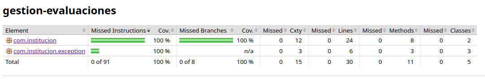

# Sistema de Gestión de Evaluaciones (`gestion-evaluaciones`) 🚀

¡Bienvenido al proyecto **gestion-evaluaciones**! Esta es una aplicación desarrollada en Java, diseñada bajo los principios de **Arquitectura Limpia (Clean Architecture)** y **Diseño Guiado por el Dominio (DDD)**, asegurando un desacoplamiento total de bases de datos físicas o frameworks externos.

Este proyecto cuenta con una cobertura de pruebas automatizadas **(Line & Branch Coverage)**, utilizando **JUnit 5** y **Mockito** para simular de manera dinámica las dependencias de infraestructura.

---

## 📋 Reglas de Negocio

El núcleo del sistema se encuentra en el servicio centralizador `EvaluationStatusPrinterService`. Este servicio es el encargado de validar y procesar la impresión de los exámenes bajo tres estrictas reglas de negocio:

1. **Regla del Estado**: El examen (`Evaluation`) a imprimir debe encontrarse estrictamente en estado `Pendiente`. Si está en un estado diferente, el sistema detendrá el proceso y lanzará una excepción de negocio.
2. **Regla de Copias**: Las copias solicitadas para impresión deben estar en un rango válido (mayor o igual a 1 y menor o igual que 50). En caso de recibir un número menor o igual a 0, se lanzará una excepción `InvalidCopyQuantityException`.
3. **Regla de la Fecha**: La fecha de impresión planificada debe ser **estrictamente anterior** a la fecha programada para el examen. Si es igual o posterior, el sistema lo impedirá mediante `InvalidEvaluationDateException`.

---

## 🛠️ Decisiones de Diseño y Arquitectura

* **Dominio Puro:** La clase `Evaluation` representa una entidad de dominio pura. Utiliza tipos modernos de Java (como `LocalDate` para el manejo de fechas) y encapsula su comportamiento y lógica interna sin intermediación de tecnologías externas.
* **Inyección de Dependencias por Constructor:** Para favorecer el bajo acoplamiento y la testabilidad, el servicio de impresión recibe sus dependencias directamente en el constructor.
* **Abstracción de Infraestructura:** El servicio `NotificationService` se define como una interfaz pura para el envío de alertas. No se implementaron dobles manuales (como `DummyNotificationService`), delegando la simulación interactiva completamente en **Mockito** para evitar código "basura" en el entregable.
* **Control de Excepciones Limpio:** Las excepciones de negocio heredan directamente de `RuntimeException`. Esto evita ensuciar las firmas de los métodos con cláusulas `throws` y optimiza la legibilidad del código.

---

## 🧪 Estrategia de Pruebas y Cobertura (100% Coverage)

La suite de pruebas automatizada se encuentra en `EvaluationStatusPrinterServiceTest` y ha sido diseñada meticulosamente bajo el patrón **Arrange-Act-Assert (AAA)** para asegurar la protección del software frente a regresiones:

* **Pruebas de Flujo Exitoso:** Verificación del camino feliz cuando se cumplen las tres reglas de negocio.
* **Pruebas de Límites y Excepciones:** Cobertura de caminos alternativos para las reglas de estado, rango de copias inválidas y fechas incorrectas.
* **Cobertura de Excepciones Propias:** Se incluyeron pruebas unitarias que instancian y validan el comportamiento de las excepciones personalizadas, garantizando que el motor de cobertura de IntelliJ/Maven marque un  **100% en verde** tanto en líneas como en ramas condicionales.

---

### 📈 Reporte de Cobertura Interactiva
Puedes visualizar el reporte de cobertura en vivo ingresando al siguiente enlace de GitHub Pages:
👉 [Ver Reporte de Cobertura de JaCoCo](https://claudux.github.io/gestion-evaluaciones-backend/)



---

## 📂 Estructura del Proyecto

El proyecto está organizado bajo la estructura estándar de Maven:

```text
gestion-evaluaciones/
├── src/
│   ├── main/
│   │   └── java/
│   │       └── com/institucion/
│   │                       ├── exception/
│   │                       │   ├── InvalidEvaluationDateException.java
│   │                       │   ├── InvalidCopyQuantityException.java
│   │                       │   └── InvalidEvaluationDateException.java
│   │                       │── Evaluation.java
│   │                       ├── NotificationService.java
│   │                       └── EvaluationStatusPrinterService.java
│   └── test/
│       └── java/
│           └── com/institucion/
│                           └── EvaluationStatusPrinterServiceTest.java
├── pom.xml
└── README.md
